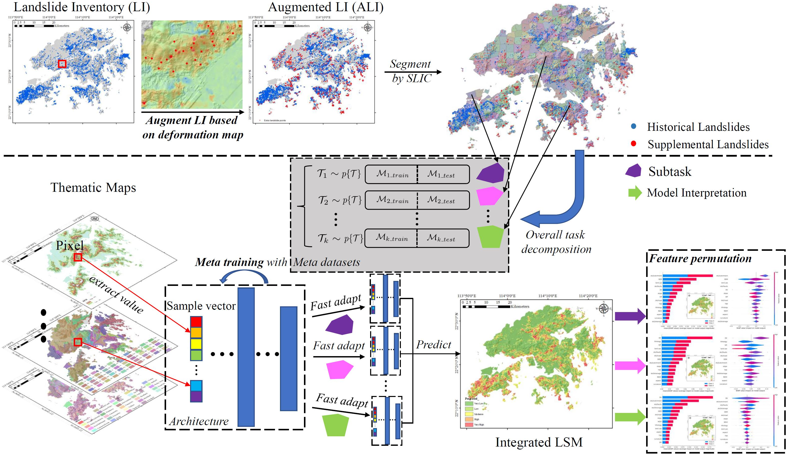

    <b>  </b>    

# Hong Kong Landslide Susceptibility Mapping in a Meta-learning Way (tf2).

[//]: # (# Landslide Susceptibility Assessment in Multiple Landslide-inducing Environments with a Landslide Inventory Augmented by InSAR Techniques)

##Table of Contents

- [Background](#background)
- [Dependencies](#dependencies)
- [Usage](#usage)
- [Contact](#contact)

## Background
Landslide susceptibility assessment (LSA) is vital for landslide hazard mitigation and prevention.
Recently, there have been vast applications of data-driven LSA methods owing to the increased
availability of high-quality satellite data and landslide statistics. However, two issues remain to
be addressed, as follows: (a) landslide records obtained from a landslide inventory (LI) are mainly
based on the interpretation of optical images and site investigation, resulting in current datadriven
models being insensitive to slope dynamics, such as slow-moving landslides; (b) Most
study areas contain a variety of landslide-inducing environments (LIEs) that a single model
can not accommodate well. In this study, we proposed the utilization of InSAR techniques
to sample weak landslide labels from slow-moving slopes for LI augmentation; and meta-learn
intermediate representations for the fast adaptation of LSA models corresponding to different
LIEs. We performed feature permutation to identify dominant landslide-inducing factors (LIFs)
and fostered guidance for targeted landslide prevention schemes. The results obtained in Hong
Kong revealed that deformation in several mountainous regions are closely associated with the
majority of recorded landslides. By augmenting the LI using InSAR techniques, the proposed
method improved the perception of potential dynamic landslides and achieved better statistical
performance. The discussion highlights that slope and stream power index (SPI) are the key
LIFs in Hong Kong, but the dominant LIFs will vary under different LIEs. By comparison, the
proposed method entails a fast-learning strategy and extensively outperforms other data-driven
LSA techniques, e.g., by 3-6% in accuracy, 2-6% in precision, 1-2% in recall, 3-5% in F1-score,
and approximately 10% in Cohen Kappa.

 

​         Fig. 1: Overflow

## Dependencies

This code is implemented with the anaconda environment:
* cudatoolkit 11.2.2
* cudnn 8.1.0.77
* gdal 3.2.3
* numpy 1.23.3
* pandas 1.5.0
* python 3.9.13
* scikit-learn 1.1.2
* tensorflow 2.10.0
* tqdm 4.64.1

## Data

* The landslide inventory can be found at [here](https://data.gov.hk/en-data/dataset/hk-cedd-csu-cedd-entli).
* The related thematic information can be found at [here](https://geodata.gov.hk/gs).
* The nonlandslide/landslide sample vectors are filed into `./src_data/` where `samples_HK.csv` and `samples_HK_noTS.csv` are datasets with and without augmented slow-moving landslides, respectively.

[//]: # ()
[//]: # (The source and experiment data will be opened...)

## Usage

* For the unsupervised pretraining stage, see `./Unsupervised Pretraining/DAS_pretraining.py` and pretrain the base model. The parameter would be saved in `./unsupervised_pretraining/model_init/savedmodel.npz`.
* For the scene segmentation and task sampling stage, see `./scene_sampling.py`, the result would be output into `./metatask_sampling` folder.
* For the meta learner, see `./meta_learner.py`. 
* For the model adaption and landslide susceptibility prediction, see `./predict_LSM.py`. The intermediate model and adapted models of blocks would be saved in folder `./checkpoint_dir` and `./models_of_blocks`, respectively.The adapted models will predict the susceptibility for each sample vector in `./src_data/grid_samples_HK.csv`.
* The `./tmp` folder restores some temp records.
* For the figuring in the experiment, see `./figure.py`, the figures would be saved in folder `./figs`.

## Contact
To ask questions or report issues, please open an issue on the [issue tracker](https://github.com/CLi-de/Meta_LSM/issues).

