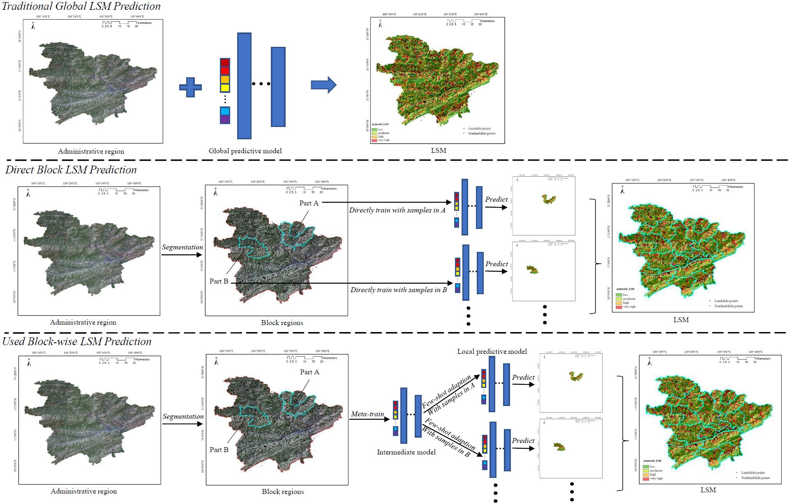
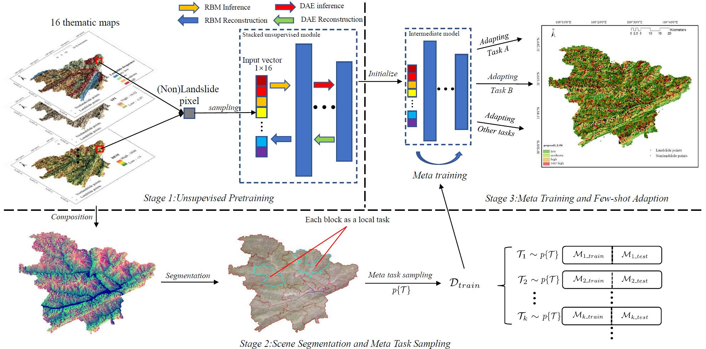

# meta_LSM
# Block-wise Prediction of Landslide Susceptibility in A Meta-learning Way.

this repo contains code accompaning the paper, [Meta-learning An Intermediate Representation for Few-shot block-wise Prediction of Landslide Susceptibility](). It contains the code of 1) unsupervised pretraining; 2) scene segmentation and task sampling; 3) the meta learner and the few-shot adaption for LSM prediction. Also, it provides the drawing of most experimental figures.

##Table of Contents

- [Background](#background)
- [Dependencies](#dependencies)
- [Data](#data)
- [Usage](#usage)
- [Contact](#contact)

## Background
Predicting a landslide susceptibility map (LSM) is essential for risk recognition and potential disaster prevention. Despite the successful adoption of existing data-driven prediction approaches, current statistical methods generally apply a single global model to predict the LSM for the whole target region. However, we argue that, in complex circumstances, especially in large-scale area, each part of the region holds different landslide inducing environment, and therefore should be predicted individually with specific models. In this study, the target scenarios are segmented into blocks for individual analysis using topographical factors. Apparently, simply conducting \textit{block-wise} training and testing independently using limited samples is hardly possible for a successful prediction. To achieve this objective, we first train an intermediate representation with the meta-learning paradigm, which is superior for capturing imformation from LSM tasks so as to generalize that information proficiently.  We choose it in the hypothesis that there are more general concepts among LSM tasks that are sensitive to varies in input features.  Thus using the intermediate representation, we can then easily adapt the model to different blocks or even unseen tasks by few exemplar samples.

 
​         Fig. 1: Global vs block-wise prediction

 
		Fig. 2: Overview

## Dependencies

This code is implemented with the anaconda environment:
* python 3.6.8
* tensorflow-gpu v1.9.0
* gdal 3.0.4
* numpy 1.19.5
* opepyxl 3.0.7
* pandas 0.25.2
* scipy 1.3.0
* scikit--image 0.17.2
* scikit-learn 0.21.2
* sklearn 0.0
* tqdm 4.55.0

## Data

* Thematic maps of Fengjie County (FJ) and Fuling District (FL) formatted as `.tif` with `.twf`, are stored in folders `./src_data/FJ` and `./src_data/FJ`. 
* `src_data` folder also contains: `samples_fj_rand.xlsx`, `samples_fl_rand.xlsx` and `FJ_FL.xlsx`, respectively storing sample vectors in FJ, FL, and FJ&FL;
together with `grid_samples_fj.xlsx` and `grid_samples_fl.xlsx`, which consists of rasterized sample vectors to be predicted.
* The data is sensitive and confidential so we only provide few part of them for formating of these files.

## Usage

* For the unsupervised pretraining stage, see `./Unsupervised Pretraining/DAS_pretraining.py` and pretrain the base model. The parameter would be saved in `./DAS_logs/savedmodel.npz`.
* For the scene segmentation and task sampling stage, see `./scene_sampling.py`, the result would be output into `./seg_output` folder.
* For the the meta learner and the few-shot adaption stage, see `./meta_learner.py` and `./adaption.py`, the intermediate model and adapted models of blocks would be saved in folder `./checkpoint_dir` and `./models_of_blocks`, respectively.
* For the predicting of landslide susceptibility, see `./predict_LSM.py`, it will predict the susceptibility for each sample vector in `./src_data/grid_samples_fj.xlsx` and `./src_data/grid_samples_fl.xlsx`.
* The `./tmp` folder restores some temp records.
* For the figuring in the experiment, see `./figure.py`, the figures would be save in folder `./figs`.

## Contact
To ask questions or report issues, please open an issue on the [issues tracker](https://github.com/Young-Excavator/meta_LSM/issues).

